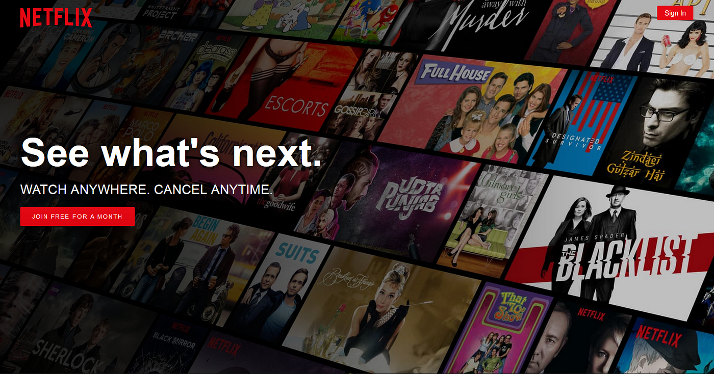

# Netflix-Data-Analysis

# Overview
Netflix is a streaming service that offers a wide variety of award-winning TV shows, movies, anime, documentaries and more – on thousands of internet-connected devices. Explore Netflix's content library through data analysis using Tableau for visualization.

# Dataset
The dataset contains details about Netflix movies and TV shows, including 'title',' show_id', 'type', 'director', 'cast', 'country', 'date_added','release_year', 'rating', 'duration', 'listed_in', 'description'.

# Key Questions
The project includes various visualizations to answer questions like:
1. What are the most common genres in the Netflix library?
2. How has the content distribution changed over the years?
3. Which countries have the highest number of Netflix titles?
4. What is the average rating of movies and TV shows on Netflix?

For more in-depth analysis and additional questions, please refer to the "Netflix Data Analysis" file.

# Data Analysis
To use this project as a starting point for your own data analysis or to enhance the existing visualizations, you can:

- Open the Tableau workbook (Netflix Dashboard.twbx) in Tableau Desktop or Tableau Public.
- Modify the existing visualizations or create new ones based on your requirements.
- Customize the dashboards and layout to present your insights effectively.

Feel free to experiment with different visualizations, filters, and parameters to derive additional insights from the Netflix dataset.

# Insights & Conclusion

